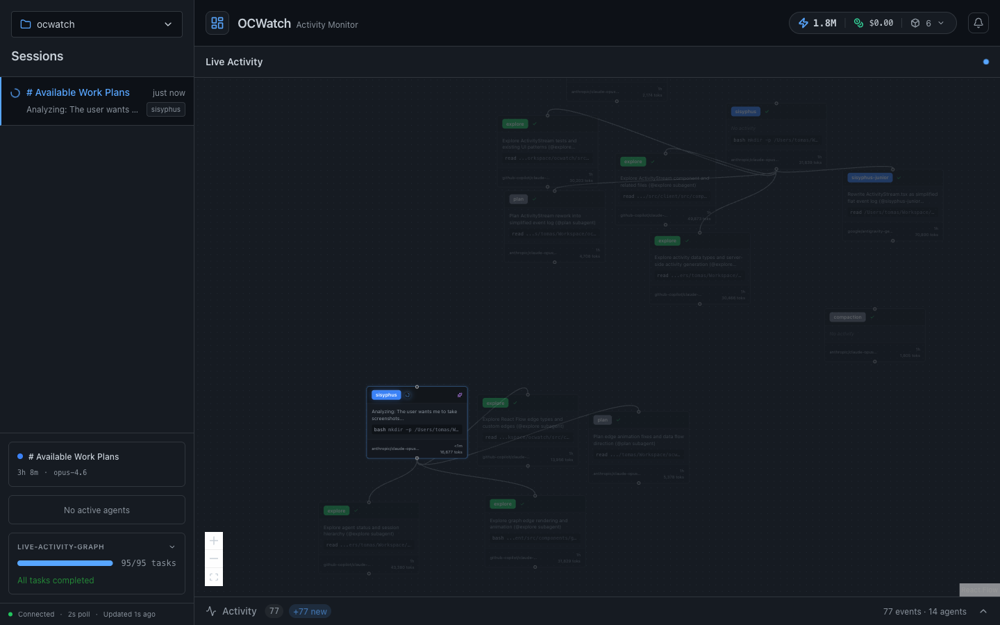
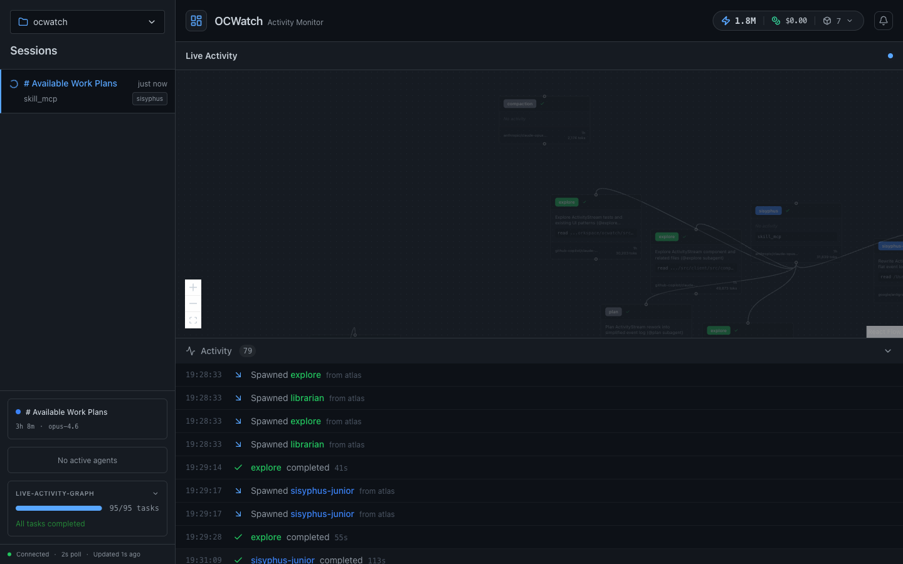

# OCWatch

Real-time web dashboard for monitoring [OpenCode](https://github.com/anomalyco/opencode) agent activity — built for use with [oh-my-opencode](https://github.com/code-yeongyu/oh-my-opencode).

## Install

```bash
bunx ocwatch
```

Or install globally:

```bash
bun install -g ocwatch
ocwatch
```

Opens a dashboard at `http://localhost:50234` showing live agent sessions, tool calls, and plan progress.

## Preview





## Options

| Flag | Description |
|------|-------------|
| `--port <number>` | Server port (default: 50234) |
| `--no-browser` | Don't auto-open browser |
| `--project <path>` | Set project directory for plan tracking |
| `--help` | Show help |

## What it monitors

- **Sessions** — active and recent agent sessions
- **Agent hierarchy** — parent/child agent tree (background agents, specialized agents)
- **Tool calls** — live tool invocations with metadata (LSP, AST, MCPs)
- **Plan progress** — task completion from `.sisyphus/boulder.json`
- **Activity stream** — real-time feed of agent actions

## Requirements

- [Bun](https://bun.sh) v1.0+
- macOS
- [OpenCode](https://github.com/anomalyco/opencode) running (reads from `~/.local/share/opencode/storage/`)

## Disclaimer

This project is not built by the OpenCode team and is not affiliated with or endorsed by [OpenCode](https://opencode.ai) or [oh-my-opencode](https://github.com/code-yeongyu/oh-my-opencode).

## License

MIT
