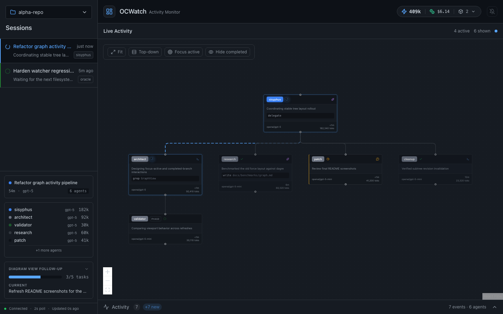
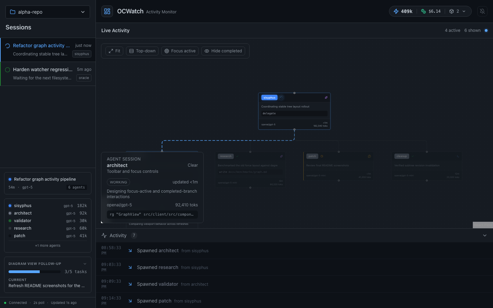

# OCWatch

Real-time web dashboard for monitoring [OpenCode](https://github.com/anomalyco/opencode) agent activity — built for use with [oh-my-opencode](https://github.com/code-yeongyu/oh-my-opencode).

## Install

```bash
bunx ocwatch
```

Or install globally:

```bash
bun install -g ocwatch
ocwatch
```

Opens a dashboard at `http://localhost:50234` showing live agent sessions, tool calls, and plan progress.

## Preview





## Options

| Flag | Description |
|------|-------------|
| `--port <number>` | Server port (default: 50234) |
| `--host <address>` | Bind address (default: localhost, use 0.0.0.0 for all interfaces) |
| `--no-browser` | Don't auto-open browser |
| `--project <path>` | Set project directory for plan tracking |
| `--help` | Show help |

## What it monitors

- **Sessions** — active and recent agent sessions
- **Diagram view** — stable parent/child activity tree with focus controls and agent inspector
- **Tool calls** — live tool invocations with metadata (LSP, AST, MCPs)
- **Plan progress** — task completion from `.sisyphus/boulder.json`
- **Activity stream** — real-time feed of agent actions

## Architecture

- **Backend**: Bun + Hono — REST API, static file serving, `fs.watch` on OpenCode storage directories
- **Frontend**: React 19 + Vite + Tailwind CSS — single dark-theme SPA
- **Graph visualization**: XY Flow for the agent activity tree
- **Data flow**: file watcher → cache invalidation → ETag polling + SSE → client
- **Monorepo layout**: `src/server/`, `src/client/`, `src/shared/` with `@server/`/`@client/`/`@shared/` path aliases

## Requirements

- [Bun](https://bun.sh) v1.0+
- macOS
- [OpenCode](https://github.com/anomalyco/opencode) running (reads from `~/.local/share/opencode/storage/`)

## Development

**Setup**

```bash
git clone https://github.com/tomascoox/ocwatch.git
cd ocwatch
bun install
cd src/client && bun install && cd ../..
```

**Run**

```bash
bun run dev              # Server + Vite concurrently
bun run dev:server       # Server only (port 50234)
bun run dev:client       # Vite only (port 5173, proxies /api → server)
```

**Test**

```bash
bun run test                           # Server/shared tests
cd src/client && bun run test          # Client unit tests (Vitest)
cd src/client && bun run test:e2e      # E2E tests (Playwright)
```

**Type check & lint**

```bash
bun run tsc -b
cd src/client && bun run lint
```

## Contributing

See [CONTRIBUTING.md](CONTRIBUTING.md).

## Disclaimer

This project is not built by the OpenCode team and is not affiliated with or endorsed by [OpenCode](https://opencode.ai) or [oh-my-opencode](https://github.com/code-yeongyu/oh-my-opencode).

## License

MIT
